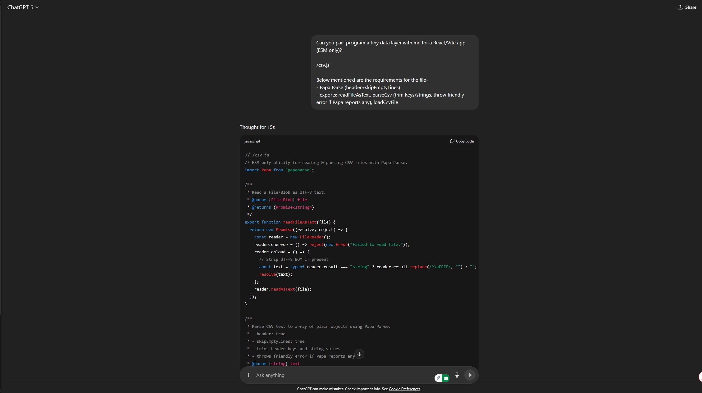
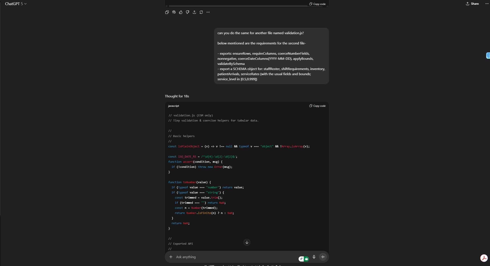

## Author

- Name: Gurnoor Singh Batth
- Student ID: 300167726  
- Course: Decision Support Systems  
- Institution: University of the Fraser Valley
- Term: Fall 2025   
- Email: gurnoor.batth@student.ufv.ca_  

## Assignment 2 Extensions

This repository is the Assignment 2 version of the Healthcare DSS.

New in Assignment 2:
- Predictive analytics (forecast patient arrivals using regression)
- Prescriptive analytics (optimize staffing using that forecast)
- Scenario comparison (pessimistic / baseline / optimistic)
- KPIs and ROI impact for management
- Central config file (`config/config.json`) so assumptions are not hardcoded
- `analysis/` folder for reproducible scripts:
  - `predict_demand` (forecast demand)
  - `optimize_staffing` (cost-minimizing staffing plan)

These pieces feed into the existing DSS pages (Inventory, Patient Flow, Staffing, ROI).

# Healthcare DSS — Inventory, Patient Flow, Staffing, ROI

A small Decision Support System (DSS) for hospital/clinic operations.  
It helps managers answer three everyday questions with simple, explainable rules:

1) Inventory – When should we reorder? How much should we order?  
2) Patient Flow – How many staff do we need to keep waits down?  
3) Staffing – Who should work each shift at the lowest cost (one shift per person per day)?  

A fourth page, Management ROI, estimates payback and NPV from using the tool.

---

## Problem domain & decisions supported

Domain: Healthcare operations (tactical, structured decisions).  

Decisions:
- Inventory management: Set reorder points, target stock levels, and typical order sizes using a simple “days-of-cover” policy. Compare estimated yearly cost vs. a monthly-ordering baseline.

- Patient flow (capacity): Recommend the smallest number of servers (e.g., clinicians) meeting a utilization cap and a queue-wait target using a basic M/M/s model (Erlang C).

- Staffing (assignment): Build a shift schedule by choosing the lowest-cost qualified person for each slot, with a “max one shift per day” rule.

- Management ROI: Summarize expected savings vs. costs (payback months, NPV, and cash-flow list).

**Assignment 2 Extension (Healthcare, Tactical + Structured):**  
We added a predictive + prescriptive pipeline focused on **staff scheduling**, **inventory context**, and **patient flow**. The predictive step forecasts next‑day demand by shift (morning/evening/night) using a simple regression on **hour‑of‑day** and a **weekend** flag. The prescriptive step uses that forecast to recommend **how many people per role** to schedule per shift at **minimum labor cost**, while enforcing a coverage rule (capacity ≥ demand). Outputs include coverage rate, shortfall (patients), and total cost, helping managers weigh ROI and organizational impact without changing any of the original Assignment 1 logic.


---

## Installation
Prerequisites
- Node.js ≥ 18 (LTS recommended)
- npm ≥ 9

Clone & install

git clone https://sc-gitlab.ufv.ca/202509cis480on1/gu26/assignment2.git
cd assignment2
npm install
pip install pandas scikit-learn
python analysis/predict_demand.py
pip install pulp
python analysis/optimize_staffing.py

After running the two commands above, open the app and use **Staffing Results** to upload `data/staffing_summary.csv` for an easy, manager‑friendly view.  

PLEASE NOTE THAT IT IS VERY IMPORTANT TO RUN NPM INSTALL AND PIP INSTALL QUERIES TO INSTALL ALL THE REQUIRED DEPENDENCIES.

---

## How to run the application

Development server

npm run dev
Open the printed local URL in your browser (e.g., http://localhost:5173).

---

## Dependencies & requirements

Core stack
- React + React Router (single-page app)
- Vite (fast dev server/bundler)
- Tailwind CSS (utility styles)
- PostCSS + Autoprefixer (Tailwind pipeline)

---

## Folder STRUCTURE

**New files/folders introduced:**  
- `config/config.json` — hours per shift, capacity/hour by role, scenario multipliers, finance rates  
- `analysis/predict_demand.py` — forecast script with R² & RMSE in `analysis/model_metrics.json`  
- `analysis/optimize_staffing.py` — optimizer that writes `data/staffing_plan.csv` and `data/staffing_summary.csv`  
- `src/pages/StaffingResults.jsx` — tiny UI to read the optimizer’s summary CSV and show KPIs
```


src/
  models/        # simple, plain-English math/logic
    inventory.js # days-of-cover policy & cost estimate
    flow.js      # small M/M/s (Erlang C) + server picker
    staffing.js  # greedy cost-first assignment
    roi.js       # payback, NPV, cash flows
  pages/         # UI pages (plain-English labels and tables)
    Home.jsx
    Inventory.jsx
    Flow.jsx
    Staffing.jsx
    ROI.jsx
    StaffingResults.jsx
  utils/
    csv.js       # CSV loading
    validation.js# schema checks for required columns/types
public/
  samples/       # sample CSV files (for quick testing)
docs/
  design.md      # design document (why/what/how)
  user_guide.md  # screenshots and step-by-step usage
analysis/
  optimize_staffing.py  # optimizer that writes `data/staffing_plan.csv` and `data/staffing_summary.csv
  predict_demand.py  # forecast script with R² & RMSE in `analysis/model_metrics.json
config/
  config.json  # hours per shift, capacity/hour by role, scenario multipliers, finance rates
```

---

## Data files (CSV)

Keep headers lowercase and spelled exactly as shown.

| File | Required columns | Purpose |
|---|---|---|
| `inventory.csv` | `item, annual_demand, unit_cost, setup_cost, holding_cost_rate, lead_time_days` | Inventory policy (we use the columns for the simple days-of-cover approach). |
| `patient_arrivals.csv` | `date, hour, arrivals` | Average arrivals/hour for patient flow capacity sizing. |
| `staff_roster.csv` | `staff_id, name, role, wage_per_hour` | Who can work, role, and hourly wage . |
| `shift_requirements.csv` | `date, shift, role, required` | How many staff you need per shift and role. |
| `staffing_summary.csv` | `date,shift,scenario,predicted_patients,total_capacity,shortfall,total_cost,coverage_rate,status` |

Sample files live in `/public/samples/`.


---


## AI Contribution

I asked CHATGPT to pair-program a CSV parser file that loads and cleans up the data, and a validation file that makes sure the data is correct (for example, numbers aren’t negative and dates are in the right format) and validate datasets against predefined schemas for staff rosters, shift requirements, inventory, patient arrivals, and service rates.
Please see below for screen shots of both chat transcripts





---

## Notes & disclaimers

- See `docs/design.md` for architecture & design choices, and `docs/user_guide.md` for screenshots and troubleshooting.


---


## Installation


## Notes

**Assignment 2 notes :**  
- No hardcoded constants: all key assumptions are in `config/config.json`.  
- CSV‑in / CSV‑out by design for transparency and easy grading; no database required.  
- If **shortfall** appears in any scenario/date/shift, either add staff to the roster or increase capacity per hour by role in config (trade‑off: higher coverage ⇒ higher cost).  
- Forecast quality depends on historical data volume/features. If RMSE is high, add more days or features (e.g., day‑of‑week, holidays).  
- Solver: uses **PuLP** (CBC). Install with `pip install pulp`. No paid solver needed.


## Results

**Assignment 2 key findings (summary):**  
- **Scenarios:** pessimistic, baseline, optimistic (configurable multipliers).  
- **Coverage vs Cost:** meeting demand in busier scenarios may require more RNs/LPNs or higher capacity assumptions; coverage ↑ often increases cost.  
- **Transparency:** each output row includes date/shift/scenario, predicted patients, capacity, shortfall, and cost—so decisions are auditable and reproducible.  
- **ROI Link:** totals from staffing feed management ROI to estimate payback/NPV using explicit cash‑flow assumptions.
